# ObsiDOOM

 
 

Play DOOM and other classic games in your Obsidian.md vault.

Supported Games: DOOM, DOOM II, Wolfenstein 3D, Heretic, Prince of Persia, Mortal Combat, GTA, Sim City, Need for Speed, Tyrian 2000, The Lost Vikings, and Out of This World.

This plugin is based on [js-dos](https://github.com/caiiiycuk/js-dos) using [DOS Zone](http://dos.zone/) to host the games.

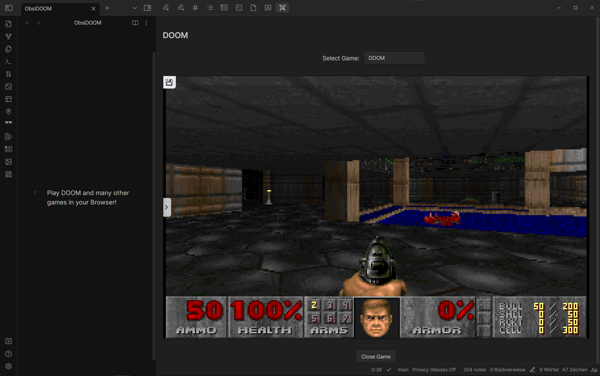

## Changing Settings and Muting the Game

Use the side panel within the game view to change settings, mute the game, save and load games, stop the game, and more.

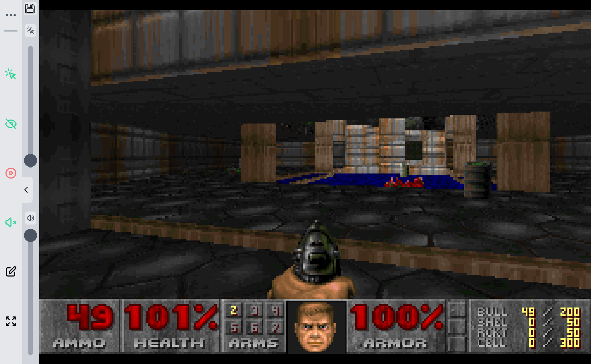

## Can I Play Other Games?

Yes, it's possible to add more games. If you want another game go to http://dos.zone/ and find the game you want.
Create a new pull request with the name of the game and the link to the game in the [GAME_URLS.json](GAME_URLS.json) file
or create an issue with the link to the game and I'll add it.

## More Games!

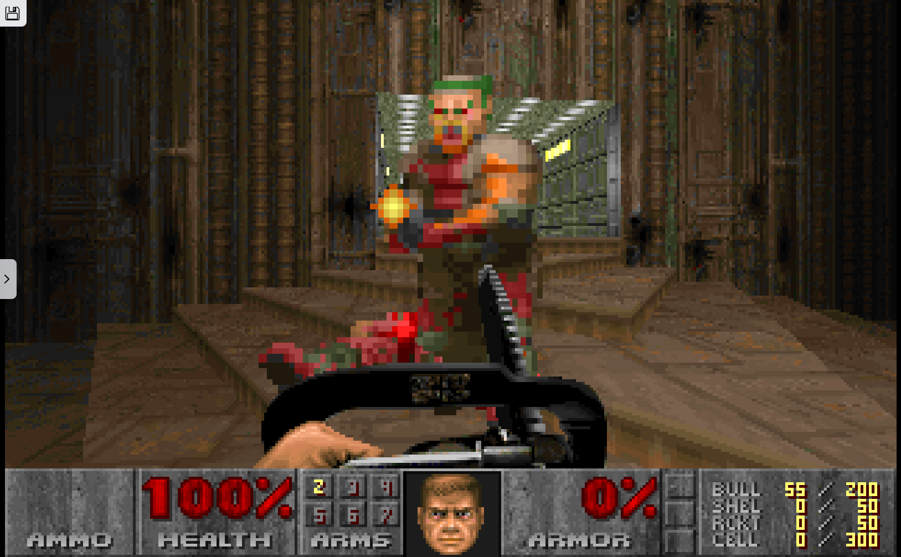

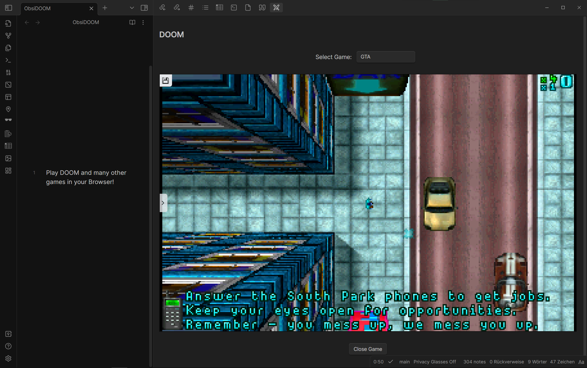

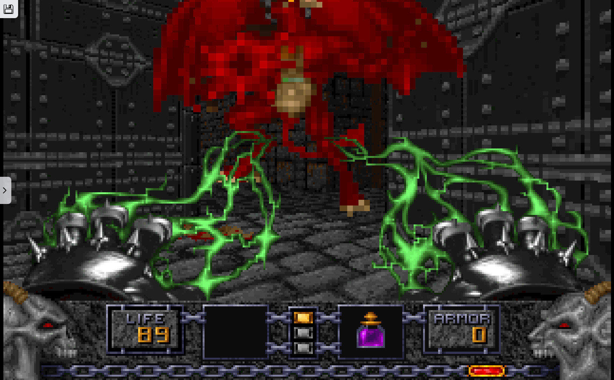

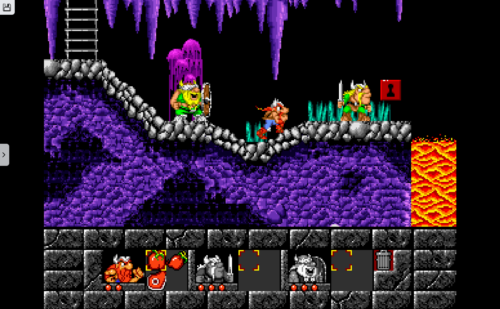

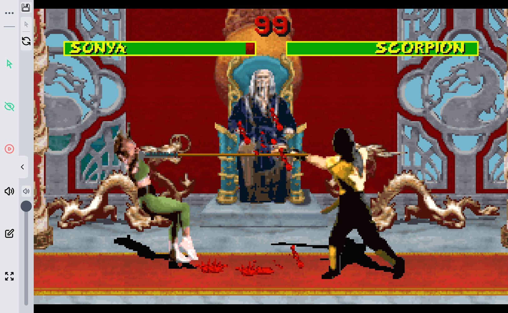

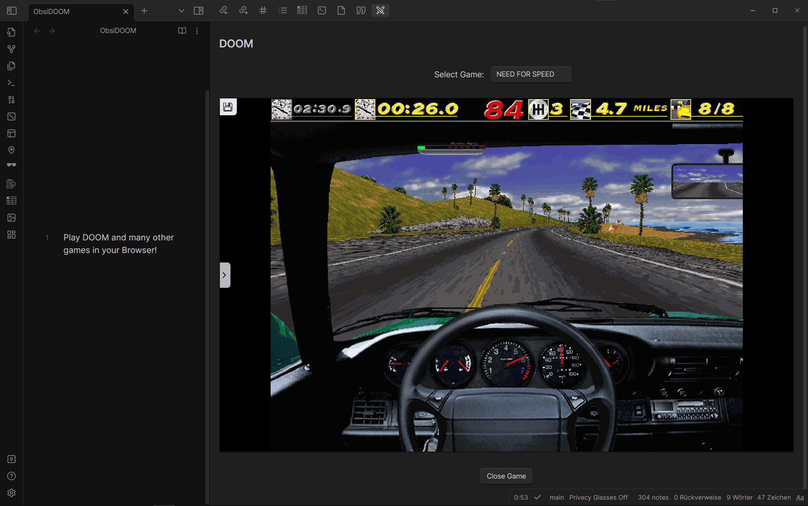

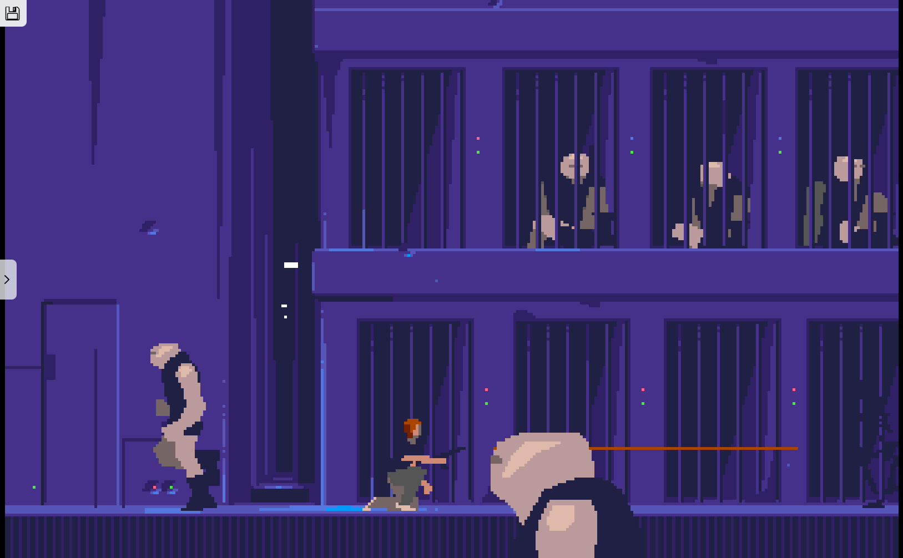

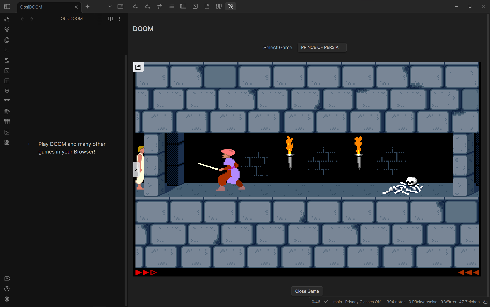

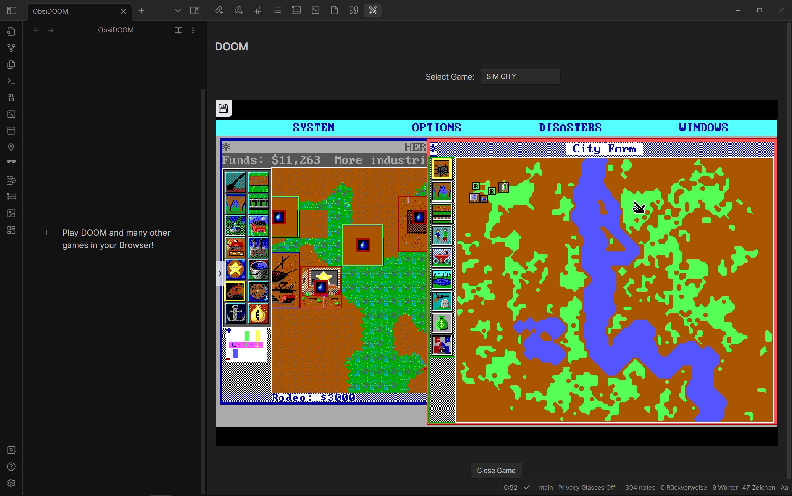

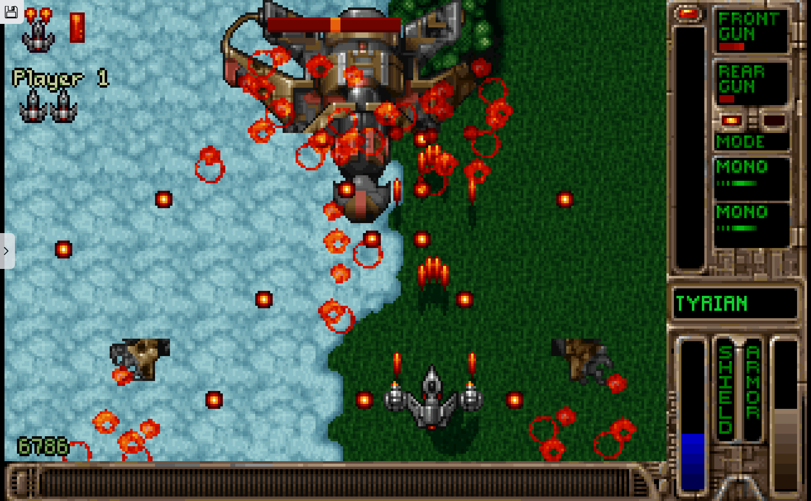

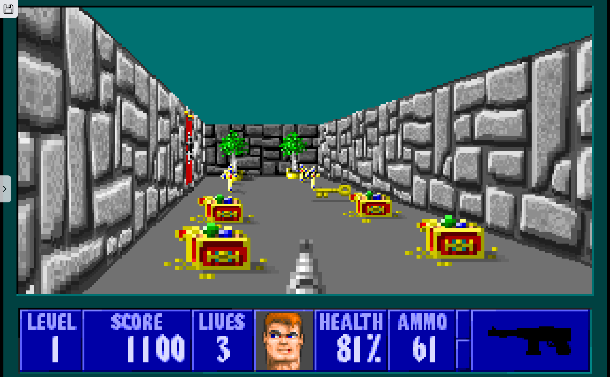

  

  

## Thanks to all Contributors! ❤

